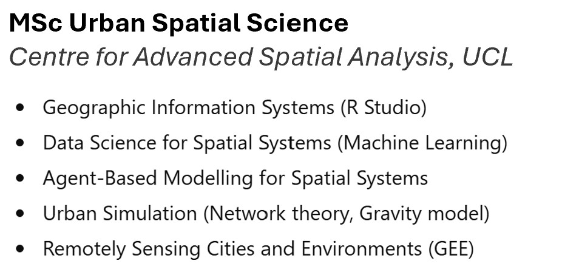

{width="392"}

+------------------------------------------------------------------------------------------------------------------------------------------------------------------------------------------------------------------------------------------------------------------------------------------------------------------------------------------------------------------------------------------------------------------------------------------------------------------------------------------------------+---------+
| **Nooriza Maharani**                                                                                                                                                                                                                                                                                                                                                                                                                                                                                 |         |
|                                                                                                                                                                                                                                                                                                                                                                                                                                                                                                      |         |
| Early-career Data Analyst with a professional geospatial background, supporting policy, planning, and data-driven decision-making through 5 years of applied geospatial analysis across government and NGO sectors. Recently completed postgraduate training in data analytics, with hands-on experience building analytical pipelines in Python and GEE for environmental use cases. Relevant course: Quantitative methods, Data science for spatial systems, Remotely sensing city and environment |         |
+------------------------------------------------------------------------------------------------------------------------------------------------------------------------------------------------------------------------------------------------------------------------------------------------------------------------------------------------------------------------------------------------------------------------------------------------------------------------------------------------------+---------+

## [Education]{style="color:#0C39CA;"}

{width="338"}
