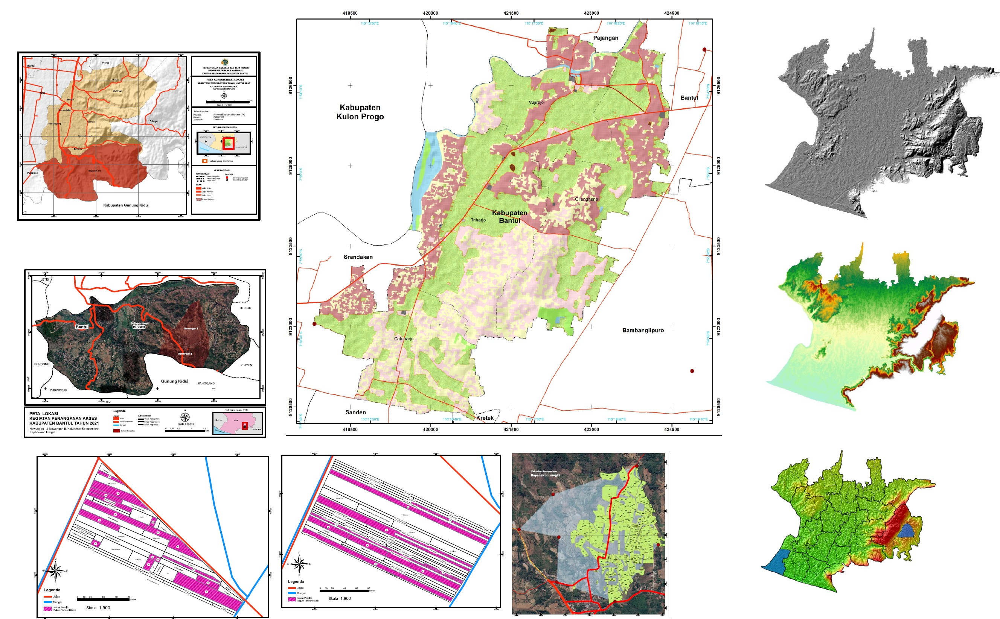

+-------------------------------------------------+------------------------------------------------------------------------------------------------------------------------------------------------------------------------------------------------------------------------------------------------------------------------------------------+
| {width="413"} | [**Mapping the distribution of Threatened Group Animals impacted by Forest Loss**](project6.qmd)                                                                                                                                                                                         |
|                                                 |                                                                                                                                                                                                                                                                                          |
|                                                 | *This is my dissertation during MSc in CASA UCL which leverages Google Earth Engine and open source datasets in order to respod Indonesia's commitment to Kunming Biodiversity Convention's which targetting a reverse Biodiversity Loss by 2030.*                                       |
+-------------------------------------------------+------------------------------------------------------------------------------------------------------------------------------------------------------------------------------------------------------------------------------------------------------------------------------------------+
| {width="158"}              | [**Building A Basic Geospatial Database with ArcGIS Pro & ArcGIS Enterprise**](project8.1qmd)                                                                                                                                                                                            |
|                                                 |                                                                                                                                                                                                                                                                                          |
|                                                 | Baseline datasets are crucial for planning and city's development. This article documents the method and results to create basic geospatial dataset such as network and land use for a high density urban area. during my time providing technical consultancy for Jakarta's institution |
+-------------------------------------------------+------------------------------------------------------------------------------------------------------------------------------------------------------------------------------------------------------------------------------------------------------------------------------------------+
|                                                 | [**Composing & Handling Field Survey Activities Using ArcMap**](project9.qmd)                                                                                                                                                                                                            |
+-------------------------------------------------+------------------------------------------------------------------------------------------------------------------------------------------------------------------------------------------------------------------------------------------------------------------------------------------+
|               | [**Predicting Pre-Teen Obesity Prevalence in London using Early Life Stressors**](project1.qmd)                                                                                                                                                                                          |
|                                                 |                                                                                                                                                                                                                                                                                          |
|                                                 | *Can childhood hardships predict obesity? Uncovering the link between early life adversity and obesity prevalence by comparing classical regression model, random forest, and XGBoost.*                                                                                                  |
+-------------------------------------------------+------------------------------------------------------------------------------------------------------------------------------------------------------------------------------------------------------------------------------------------------------------------------------------------+
|               | [**Modelling Rip-Current Rescue using Agent-Based Modelling**](project2.qmd)                                                                                                                                                                                                             |
|                                                 |                                                                                                                                                                                                                                                                                          |
|                                                 | *Inspired by a rip current tragedy in my hometown, this model visualizes maritime rescue related to rip current incidents from the ground up, using Netlogo.*                                                                                                                            |
+-------------------------------------------------+------------------------------------------------------------------------------------------------------------------------------------------------------------------------------------------------------------------------------------------------------------------------------------------+
