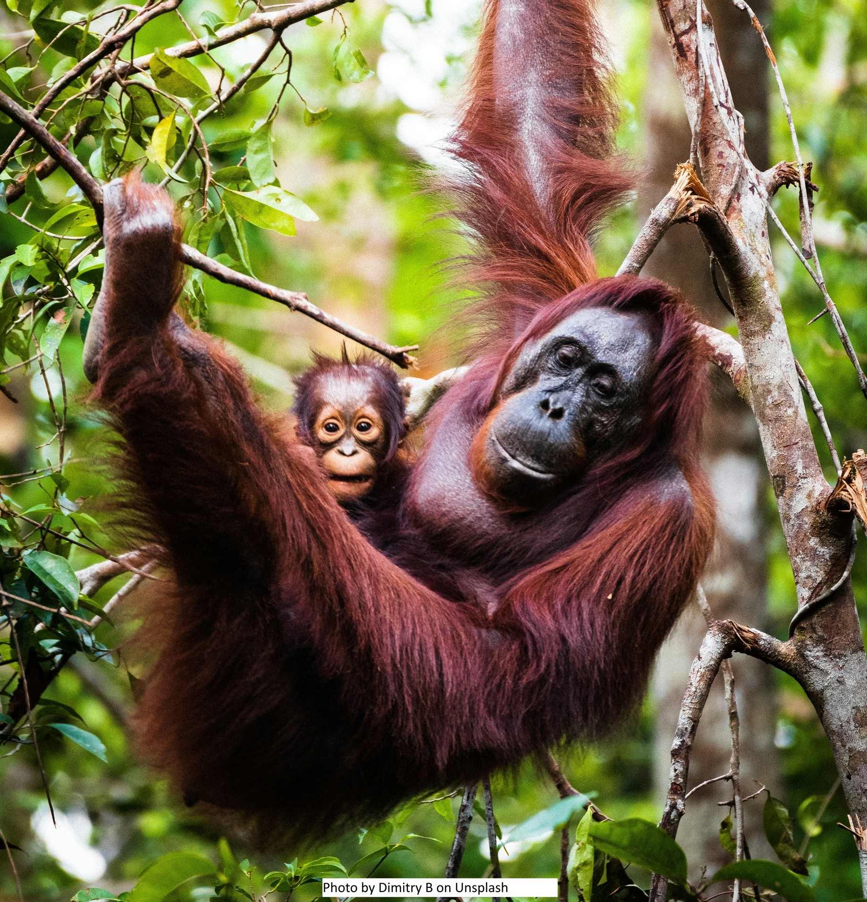
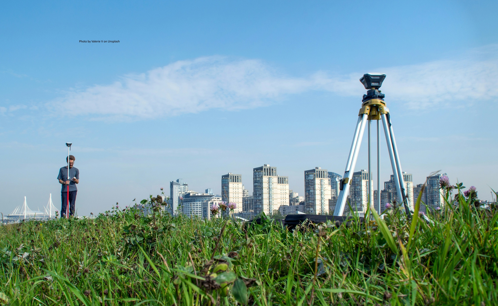
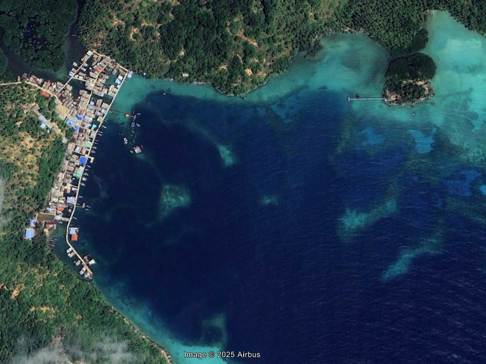

+---------------------------------------------------------------+--------------------------------------------------------------------------------------------------------------------------------------------------------------------------------------------------------------------------+
| {width="800"}               | [**Mapping the distribution of Threatened Group Animals impacted by Forest Loss**](project6.qmd)                                                                                                                         |
|                                                               |                                                                                                                                                                                                                          |
|                                                               | *This article presents my CASA UCL dissertation, which uses Google Earth Engine and open-source data to support Indonesia’s commitment to reversing biodiversity loss under the Kunming Biodiversity Convention by 2030* |
+---------------------------------------------------------------+--------------------------------------------------------------------------------------------------------------------------------------------------------------------------------------------------------------------------+
|                                                               |                                                                                                                                                                                                                          |
+---------------------------------------------------------------+--------------------------------------------------------------------------------------------------------------------------------------------------------------------------------------------------------------------------+
| {width="800"} | [**Building A Basic Geospatial Database with ArcGIS Pro & ArcGIS Enterprise**](project8.qmd)                                                                                                                             |
|                                                               |                                                                                                                                                                                                                          |
|                                                               | This article summarizes my experience creating core geospatial datasets—like road networks and land use—for Jakarta during my technical consultancy                                                                      |
+---------------------------------------------------------------+--------------------------------------------------------------------------------------------------------------------------------------------------------------------------------------------------------------------------+
|                                                               |                                                                                                                                                                                                                          |
+---------------------------------------------------------------+--------------------------------------------------------------------------------------------------------------------------------------------------------------------------------------------------------------------------+
| {width="800"}   | [**Composing & Handling Field Survey Activities Using ArcMap**](project9.qmd)                                                                                                                                            |
|                                                               |                                                                                                                                                                                                                          |
|                                                               | This article shares my experience managing a project that involved survey activities, including data preparation, integration, and field team coordination.                                                              |
+---------------------------------------------------------------+--------------------------------------------------------------------------------------------------------------------------------------------------------------------------------------------------------------------------+
|                                                               |                                                                                                                                                                                                                          |
+---------------------------------------------------------------+--------------------------------------------------------------------------------------------------------------------------------------------------------------------------------------------------------------------------+
| {width="801"}               | [**Predicting Pre-Teen Obesity Prevalence in London using Early Life Stressors**](project1.qmd)                                                                                                                          |
|                                                               |                                                                                                                                                                                                                          |
|                                                               | *Can childhood adversity predict obesity? This study compares classical regression, random forest, and XGBoost to uncover links between early life hardship and obesity prevalence*                                      |
+---------------------------------------------------------------+--------------------------------------------------------------------------------------------------------------------------------------------------------------------------------------------------------------------------+
|                                                               |                                                                                                                                                                                                                          |
+---------------------------------------------------------------+--------------------------------------------------------------------------------------------------------------------------------------------------------------------------------------------------------------------------+
| {width="800"}               | [**Modelling Rip-Current Rescue using Agent-Based Modelling**](project2.qmd)                                                                                                                                             |
|                                                               |                                                                                                                                                                                                                          |
|                                                               | *Inspired by a rip current tragedy in my hometown, this model visualizes maritime rescue related to rip current incidents from the ground up, using Netlogo.*                                                            |
+---------------------------------------------------------------+--------------------------------------------------------------------------------------------------------------------------------------------------------------------------------------------------------------------------+
