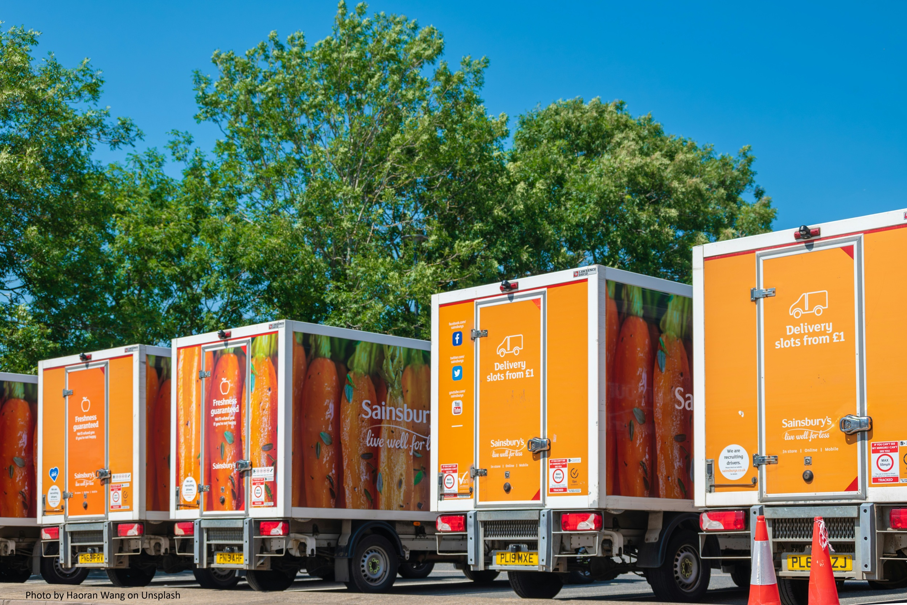
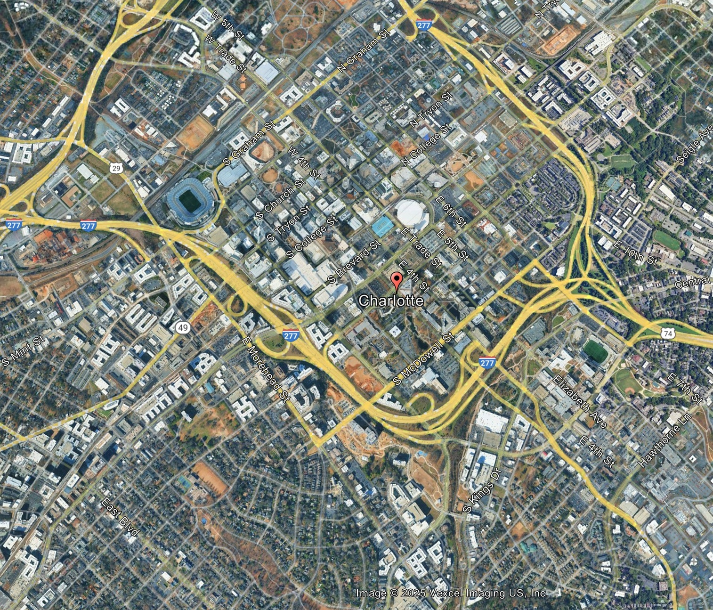
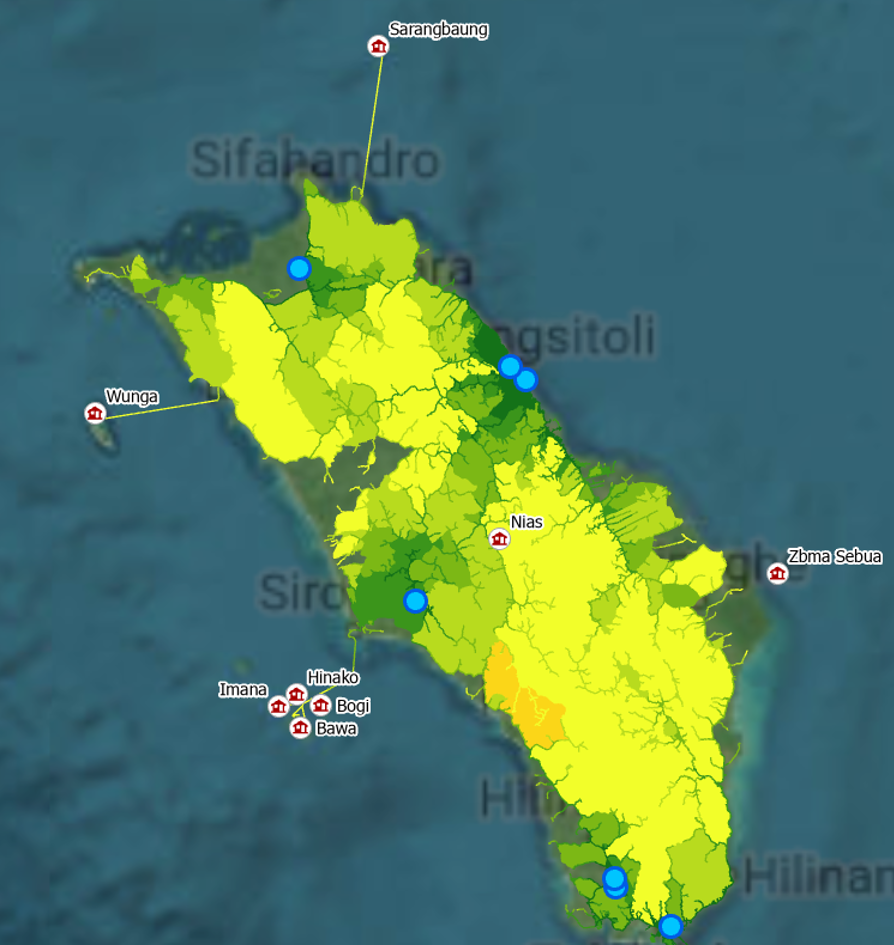

+-------------------------------------------------+----------------------------------------------------------------------------------------------------------------------------------------------------------------------------------------------------------------------------------------------------------+
| {width="370"} | [**Investigating London's Underground Resilience**](project3.qmd)                                                                                                                                                                                        |
|                                                 |                                                                                                                                                                                                                                                          |
|                                                 | *A study on how to measure the importance of London's underground network under various scenarios of vulnerabilities using networkX in python*                                                                                                           |
+-------------------------------------------------+----------------------------------------------------------------------------------------------------------------------------------------------------------------------------------------------------------------------------------------------------------+
| {width="205"} | [**Evaluating the Best Retailing Investment Opportunities in Havering, London**](project4.qmd)                                                                                                                                                           |
|                                                 |                                                                                                                                                                                                                                                          |
|                                                 | *Which location offers the greatest advantage for a new supermarket in the Borough of Havering? A comparison of two proposed sites to find the most beneficial spot using spatial interaction model in python*                                           |
+-------------------------------------------------+----------------------------------------------------------------------------------------------------------------------------------------------------------------------------------------------------------------------------------------------------------+
|               | [**Proposing Intersection Upgrade Locations in the City of Charlotte, North Carolina**](project5.qmd)                                                                                                                                                    |
|                                                 |                                                                                                                                                                                                                                                          |
|                                                 | *This project is part of a GIS course assessment challenge using Rstudio, focused on helping the City of Charlotte to decide where to upgrade intersections after receiving \$4.47 million to reduce pedestrian injuries and deaths.*                    |
+-------------------------------------------------+----------------------------------------------------------------------------------------------------------------------------------------------------------------------------------------------------------------------------------------------------------+
|                          | [**Modelling Healthcare Accessibility using ArcGIS Network Analysis**](project7.qmd)                                                                                                                                                                     |
|                                                 |                                                                                                                                                                                                                                                          |
|                                                 | The project is the collaboration between Indonesia's Ministry of Planning and UNICEF which aims to visualize how people access healthcare services within a specific time travel, to identify regions with low or high accessibility towards healthcare. |
+-------------------------------------------------+----------------------------------------------------------------------------------------------------------------------------------------------------------------------------------------------------------------------------------------------------------+
|                                                 |                                                                                                                                                                                                                                                          |
+-------------------------------------------------+----------------------------------------------------------------------------------------------------------------------------------------------------------------------------------------------------------------------------------------------------------+
|                                                 | *.*                                                                                                                                                                                                                                                      |
+-------------------------------------------------+----------------------------------------------------------------------------------------------------------------------------------------------------------------------------------------------------------------------------------------------------------+

::: {style="text-align: right;"}
[Next →](next.qmd)
:::
