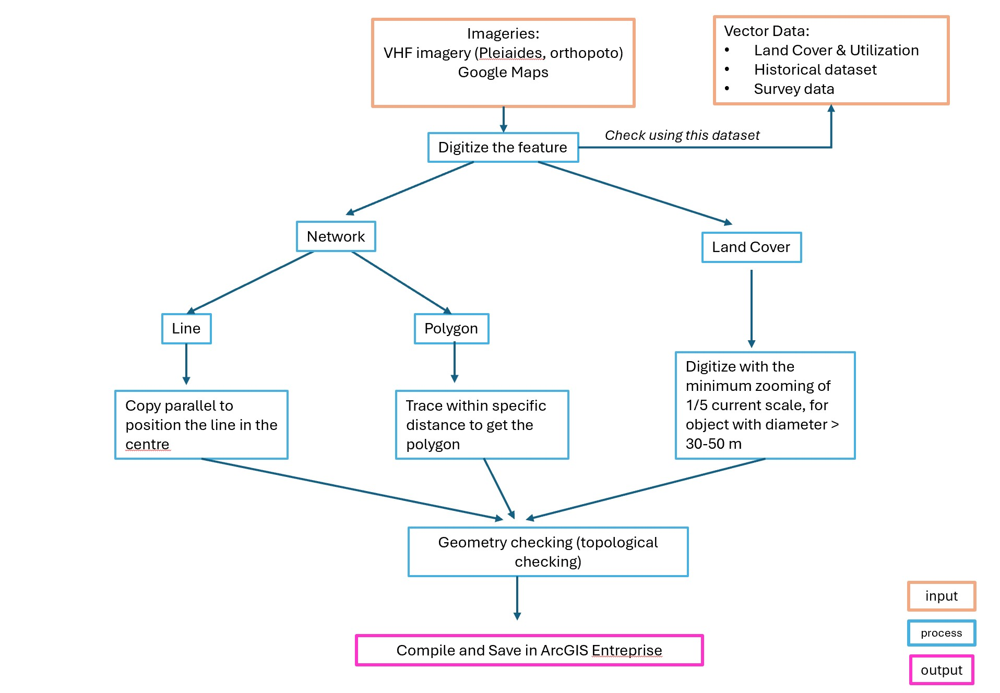
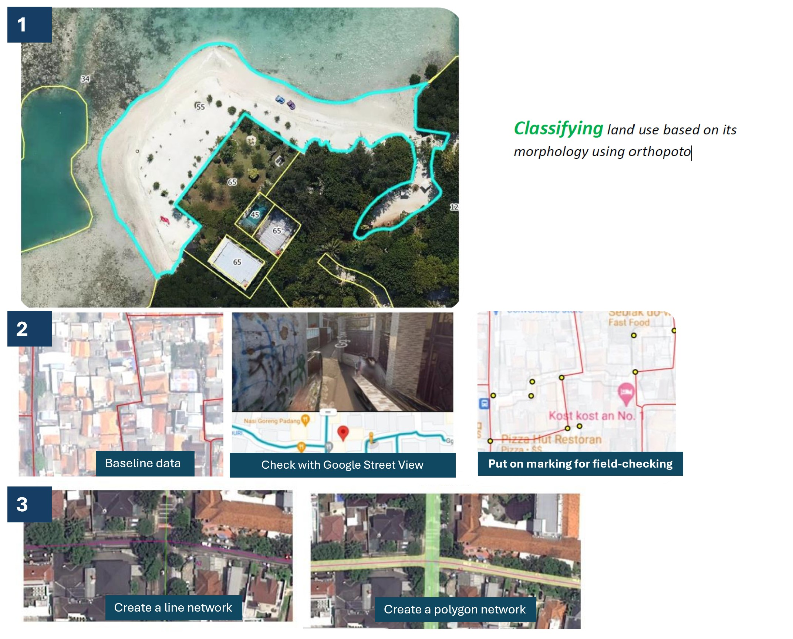
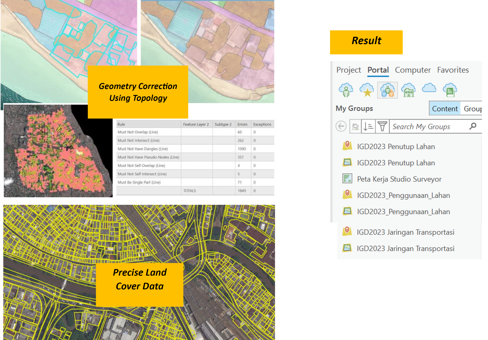

Jakarta, a capital city of Indonesia, underwent a rapid urbanisation resulting in a dynamic utility of space. It needs a detailed and an updated spatial data in a timely manner to accommodate development plan such as housing, land management etc. Within this job, I provide a technical consultancy for a year and a half to build a detailed (in 30-50 cm) network and land use dataset. Working with ArcGIS Enterprise with fellow GIS technicians, enabling us to work our area of interest simultaneously alongside our workmates. We create updated network data (both line and polygon) and land use using ArcGIS Pro and compiled the result in Jakarta's one portal Enterprise server. Here's the work flow.

{width="674"}

**Fig 8.1** Work flows executed in ArcGIS Pro and Enterpise

Here's the snapshot of how they look like in ArcGIS interface.

**Fig 8.2** The Results both network and land use

When we digitize manually, the feature might get an error such as overlapping, intersecting, potential hollowness, or disconnect (for line dataset). Therefore, topological checking is needed before compiling to the server. So before pushing to the server, we need to do geometry correction.

**Reference:**

[Copy parallel ArcGIS Pro](https://pro.arcgis.com/en/pro-app/latest/help/editing/copy-line-features-parallel.htm)

[Topology Rules ArcGIS Pro](https://pro.arcgis.com/en/pro-app/latest/help/editing/geodatabase-topology-rules-for-polygon-features.htm)
