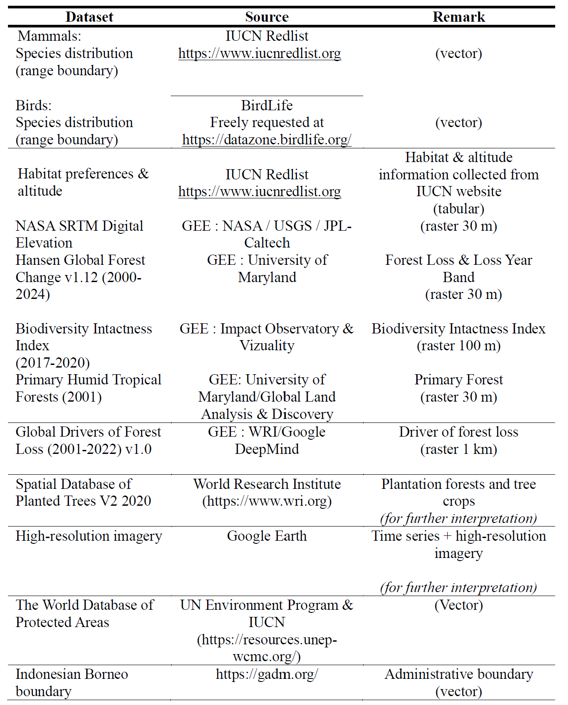
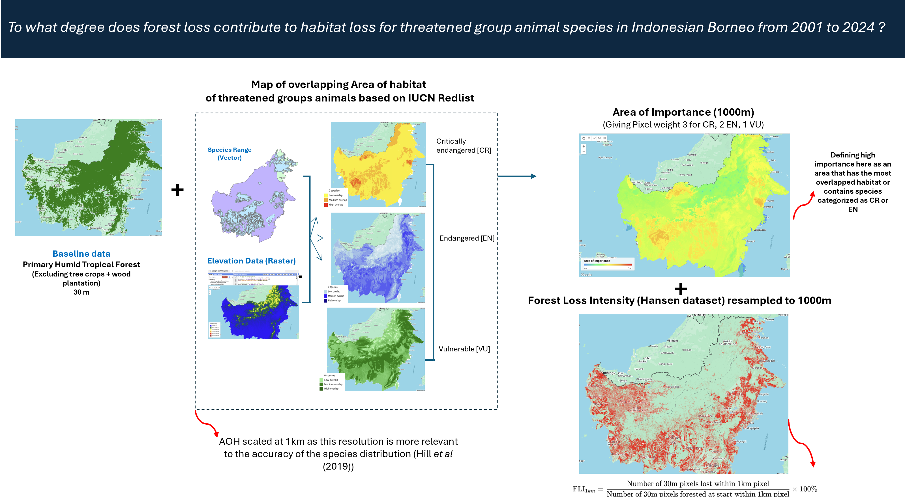
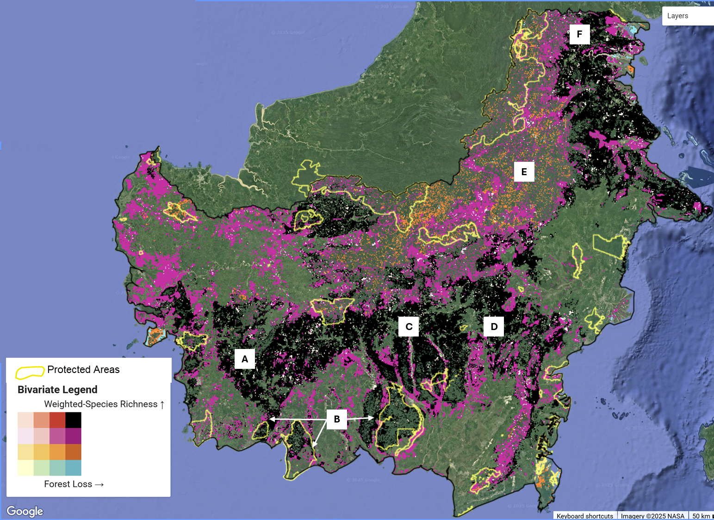
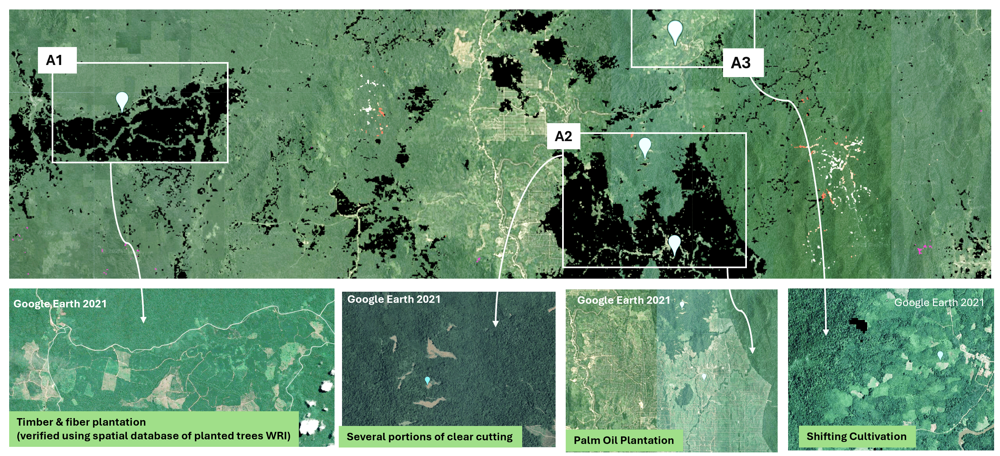
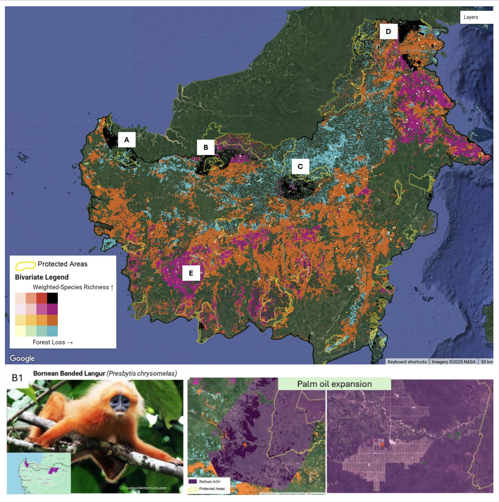

## Context

Forest sustains us: providing food to eat, oxygen to breathe, and balance to both the earth’s climate and ecosystem. Over the past decades, Borneo’s forests have been increasingly threatened by environmental pressures. This condition led Indonesian Governments to acknowledge that they need to take immediate action to protect remaining forest and species within them. One of Indonesia’s key commitments to protect biodiversity is to the KunmingMontreal Global Biodiversity Framework (GBF), which pledges to halt and reverse biodiversity loss by 2030.

However, among the ten platforms listed in the Indonesian Biodiversity Strategy and Action Plan (Government of Republic Indonesia, 2024) none has yet published a dataset that clearly shows where forest loss overlaps with the habitats of key 11species. This knowledge gap makes it hard to set a clear targets and measurable action to preserve animals’ habitat and biodiversity.

Using Google Earth Engine, this research aims to map and quantify the extent to which forest loss affects\
habitat loss for threatened animal groups, while also assessing the intactness of biodiversity in the\
remaining habitat. All the dataset used are open source, enabling a reproduceability code for conservation practices or other purposes.

## **Dataset**

{width="460"}

## Method

**Fig 6.1** Methodology adopted in the study

## Result Sample

**Fig 6.2** Bivariate Map of Weighted Species Richness and Forest Loss

The images capture how forest loss overlapped with Species-weighted Richness area. Species-weighted richness reflects the relative importance of habitats; not only in terms of species richness (the presence of various species) but also by giving importance to their extinction risk. Black colour corresponds to the high-high category that dominantly happened in the lowlands. A1, A2, and A3 correspond to a detailed snapshot and their associated driver, checked using historical imagery from Google Earth.

To identify animals of special concern, a second type of bivariate map is produced called Rarity-weighted Richness. For importance based on Rarity-weighted Richness, the results emphasise species with small range distributions.

The images illustrate how forest loss overlaps with areas important for species with small-range distributions. Panels A–D correspond to the high–high category, whereas panel E represents the medium–high category. Panel B1 provides a detailed snapshot showing how the habitat of a small-range species overlaps with palm oil plantations and is located adjacent to Lake-Based National Park. The purple colour represents the refined Area of Habitat (AOH) of the Bornean Langur, adjusted for altitude range and forest cover, while the yellow outlines indicate the boundaries of the protected National Park.

References:

Government of Republic Indonesia (2024) Indonesia Biodiversity Strategy and Action\
Plan 2025-2045. Ministry of Planning/BAPPENAS.

**Link to GEE platform:**

[Species-weighted Richness](https://code.earthengine.google.com/8b463b50ceaa044a38e15edf600495eb)

[Rarity-weighted Richness](https://code.earthengine.google.com/c2dc86afa86c47a732a90044cfccd7dd)
