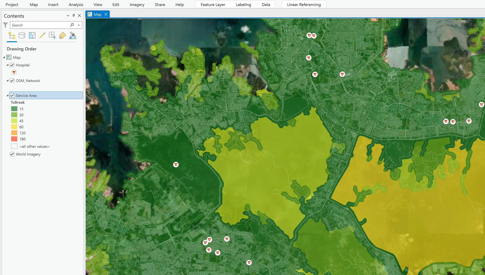
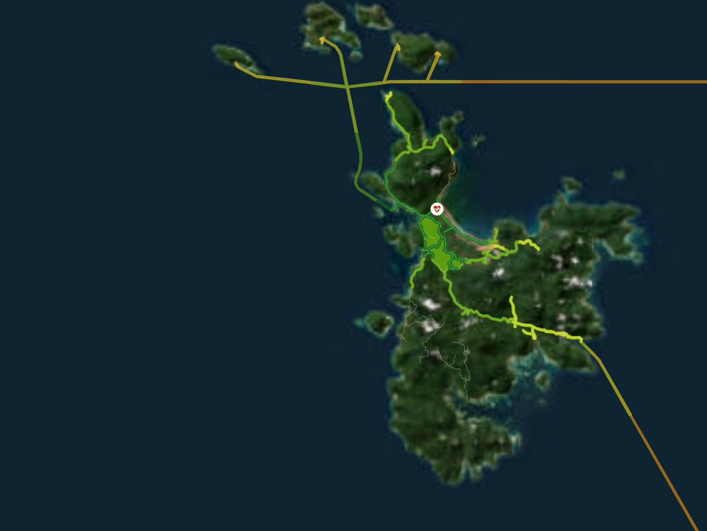

## A study on how to measure the importance of London's underground network under various scenarios of vulnerabilities using networkX in python

{width="346"}

**Fig 7.1** Network Analyst Framework in ArcGIS source : [ESRI](https://pro.arcgis.com/en/pro-app/latest/help/analysis/networks/what-is-network-analyst-.htm)

## Context

This project aims to visualize how people access healthcare services within a specific travel time. As a Geospatial Analyst, my team and I developed a framework to address data limitations, fine-tune the default settings of ArcGIS Network Analysis, and validate our modelling results in real-world settings.

We used Network Analysis in ArcGIS to model the range of healthcare services accessible within selected time intervals. What makes this work unique is its application in an archipelagic region, where we assumed Euclidean distance as a proxy for ship routes. Using this model, we aim to identify regions that fall outside the "golden hour" of medical access—critical for informing policymakers in budget allocation and improving healthcare infrastructure.

## Dataset

Two datasets are used as an input : OSM network + healthcare service points. The networks should contains the attribute such as distance (in metre) and speed (m/s). Common issues usually arise when we input these two dataset are unconnected network (check the network's topology) and unlocated facilities. Unlocated facilities are issue that arise when healthcare service points are located far from the networks, thus the algorithm will flag these facilities as unlocated. To address this issue we can : 1) check the facility's coordinate 2) update the network dataset.

{width="354"}

**Fig 7.2 Common issues during pre-processing**

## Result

**The analysis reveals that areas immediately surrounding hospitals are generally accessible within 15 minutes, indicating a relatively efficient healthcare reach in those zones.** These regions benefit from well-connected transportation networks—whether road-based or estimated maritime routes—that enable timely access to medical services. This level of accessibility is crucial during emergencies, where rapid response can significantly improve patient outcomes. The model effectively captures these service areas using isochrones, helping visualize the extent of healthcare coverage within critical time thresholds.

**Fig 7.3** Travel time to hospital

**However, more remote locations—particularly those lacking direct or integrated transport networks—face significantly longer travel times to reach hospitals.** This is especially evident in archipelagic regions, where small islands may not be connected by formal ship routes or reliable transport infrastructure. In such cases, residents are at a disadvantage during medical emergencies, as delays in reaching care can be life-threatening. These findings underscore the need for targeted interventions, such as improving transport connectivity, deploying mobile health units, or establishing satellite clinics. By identifying underserved areas, the model provides valuable insights for policymakers to prioritize healthcare investments and promote equitable access across diverse geographic settings.

**Fig 7.4** Travel time in archiplegic region.

This disparity in accessibility highlights the importance of targeted interventions. For example, improving transport connectivity, deploying mobile health units, or strategically placing new healthcare facilities could help bridge the gap for underserved areas. The model serves as a diagnostic tool to identify these vulnerable regions and guide policy decisions aimed at enhancing equitable healthcare access.
