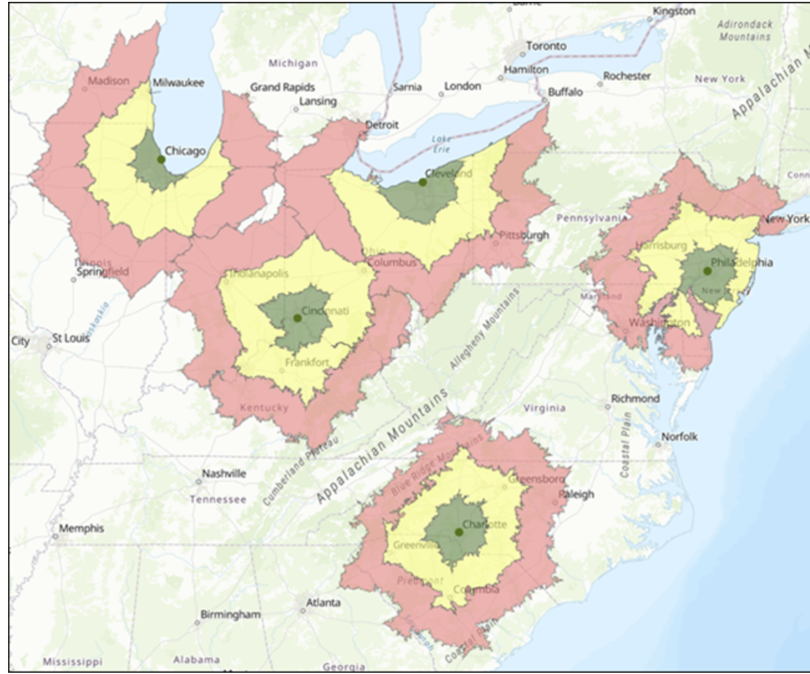
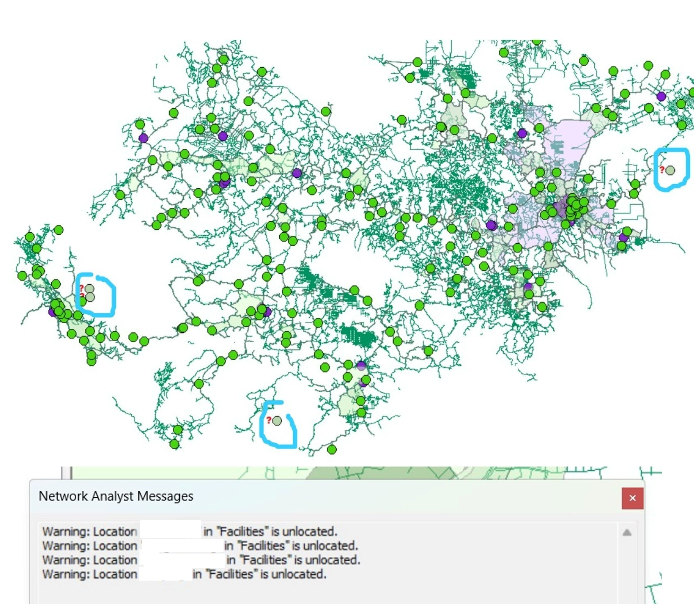
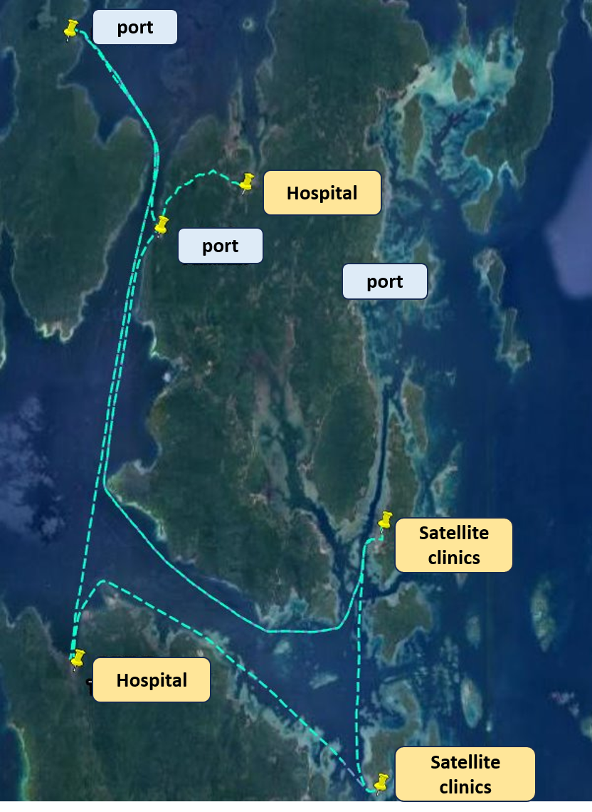
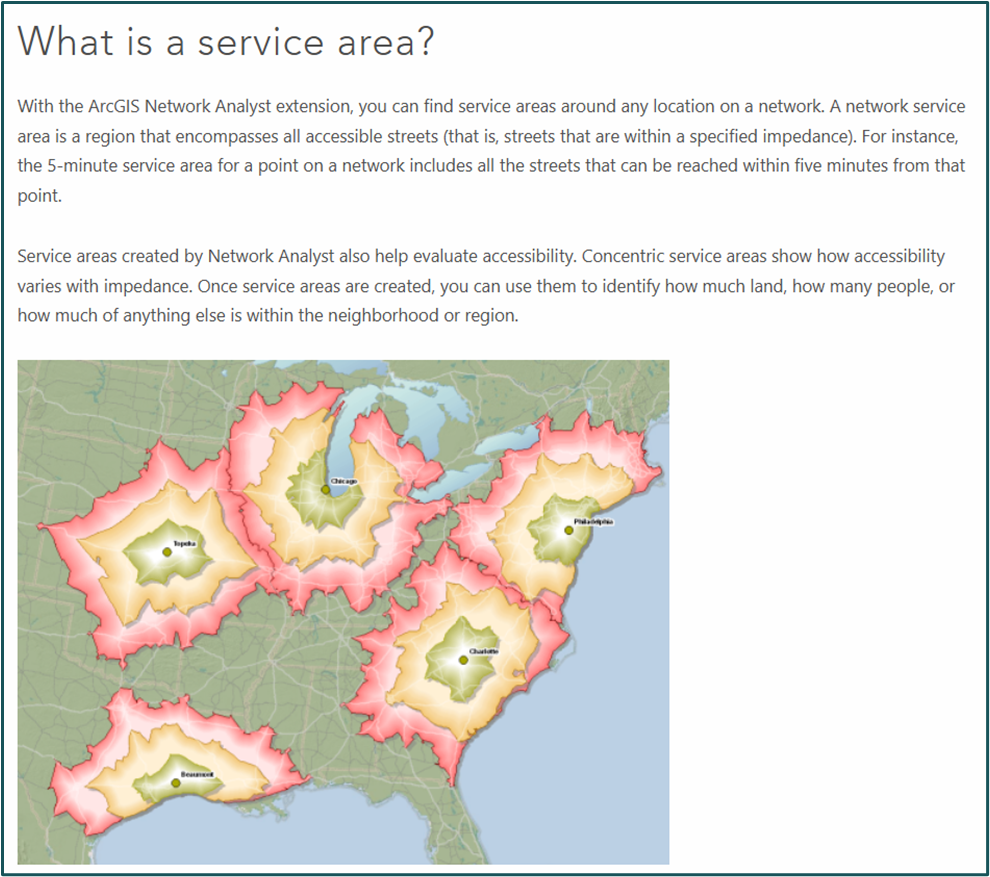
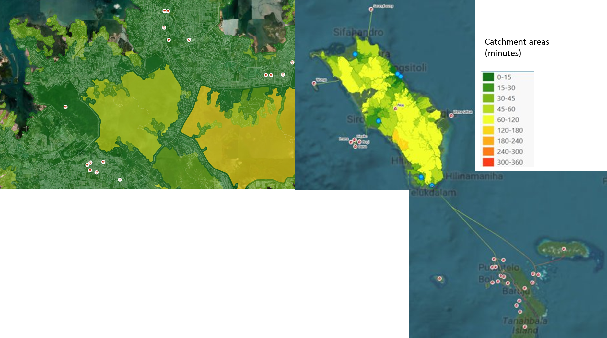
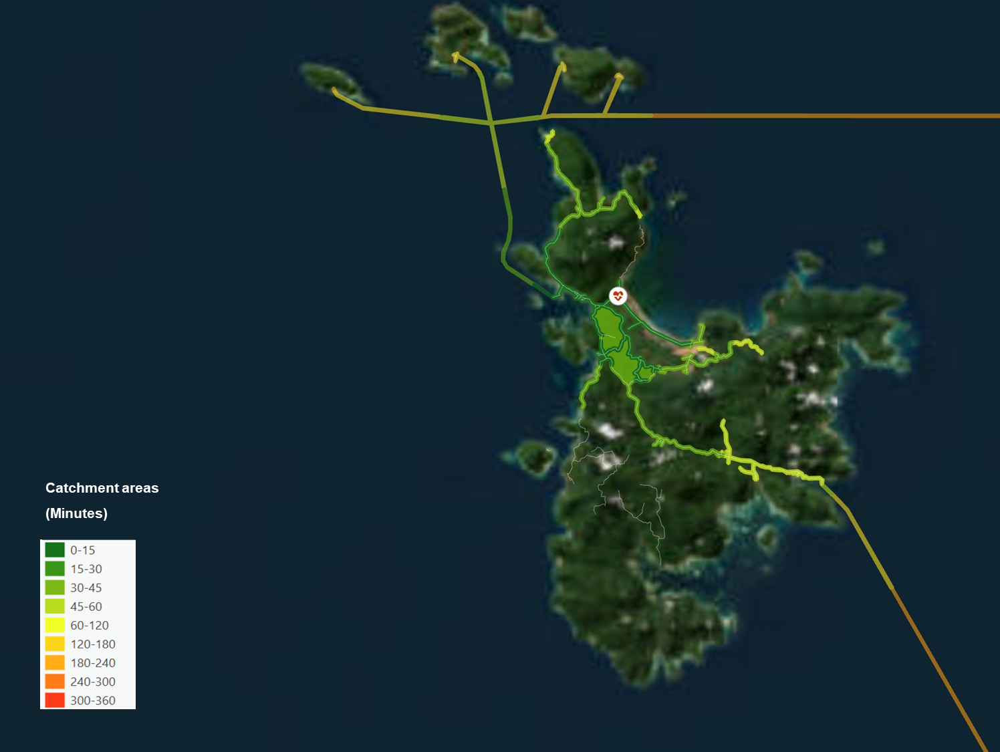

{width="346"}

Fig 7.1 Network Analyst Framework in ArcGIS source : [ESRI](https://pro.arcgis.com/en/pro-app/latest/help/analysis/networks/what-is-network-analyst-.htm)

## Context

This project aims to visualize how people access healthcare services within a specific travel time. As geospatial analysts, our team developed a framework to address data limitations in sea-related travel, applied the ESRI Network Analysis extension, and validated our modeling results in real-world settings.

This is an interesting project because Indonesia is an archipelagic region, yet ship network data is not yet available, making it hard for policymakers to picture accessibility conditions. With this result, decision-makers can easily identify regions with poor accessibility (more than a 1-hour journey) to hospitals and puskesmas (second-tier healthcare facilities), determine which regions need healthcare policy investment, and validate whether their chosen priority locations for healthcare improvement satisfy the required criteria.

We used Network Analysis to model the range of healthcare services accessible within selected time intervals. What makes this work unique is its application in an archipelagic region, where we assumed Euclidean distance as a proxy for ship routes. Using this model, we aim to identify regions that fall outside the "golden hour" of medical access; critical for informing policymakers on budget allocation and improving healthcare infrastructure.

## Data & Methodology

**A. Data**

Two datasets are used as input: OSM network data and healthcare service points. Common issues that arise when inputting these two datasets are unconnected networks (which can be addressed by checking topology) and unlocated facilities. Unlocated facilities are an issue that arises when healthcare service points are located far from the network, causing the algorithm to flag these facilities as unlocated. To address this issue, we can: 1) check the facility's coordinates, or 2) update the network dataset.

{width="354"}

Fig 7.2 Common issues during pre-processing

Data Challenges :

1.  Unlocated facilities are the most common issue when dealing with the western region. This happens because many of the points lie outside the intended territory, sometimes falling in the middle of nowhere, either in the ocean or in mountainous areas, or because the dataset overlaps in certain areas due to inaccurate latitude and longitude records. My work included addressing these unlocated facilities by comparing them with a dataset geolocated based on address keywords in Google Earth. If it still flagged an error, and trust me it happened a lot :), I had to manually check it against Google Maps.

2.  Since sea network data is not yet available, we created a proxy using Euclidean distance manually, connecting port to port between islands. This proxy must also be connected to the land network in order to run successfully.

    {width="246"}

    Fig 7.3 Sea-network journey through port-to-port simulation and field-visit

**B. Methodology**

The method used in this project follow the scheme of ESRI Network Analysis where we prepare the main dataset of facilities and network as the initial step running the workflow, including checking the topology of road networks. The networks should contains the attribute such as distance (in metre) and speed (m/s) using speed proxy for vehicles such as motorcycle and car assumed that in case of emergency they use an ambulance or private-hire car in mainland. Meanwhile, for ship speed we pick the average speed of mobile-healthcare boat unit. Below are a picture displaying the main dataset used to run the model which are facilities, network, and its intended catchment areas based on time estimates.

{width="553"}

Fig 7.4 Network Analyst Framework in ArcGIS source : [ESRI](https://pro.arcgis.com/en/pro-app/latest/help/analysis/networks/what-is-network-analyst-.htm)

## Result

**The analysis reveals that areas immediately surrounding hospitals are generally accessible within 15 minutes, indicating a relatively efficient healthcare reach in those zones.** These regions benefit from well-connected transportation networks; whether road-based or estimated maritime routes; that enable timely access to medical services. This level of accessibility is crucial during emergencies, where rapid response can significantly improve patient outcomes. The model effectively captures these service areas using isochrones, helping visualize the extent of healthcare coverage within critical time thresholds. Here's the sample of the result.

{width="629"}

Fig 7.5 Travel time to hospital

Each color represents the catchment area: that is, the time it would take to make a journey to the nearest facility. The white-pink dots represent the healthcare facilities. The closer an area is to a healthcare facility, and the denser its street network, the more likely that area will appear green, representing the 15-minute catchment area

{width="571"}

Fig 7.6 Travel time in archiplegic region.

**However, more remote locations, particularly those located far from hospitals and lacking frequent ship mobility, may face significantly longer travel times to reach hospitals.** This is especially evident in archipelagic regions, where small populated islands are widely scattered. In such cases, residents are at a disadvantage during medical emergencies, as delays in reaching care can be life-threatening. Therefore, strengthening satellite clinics (puskesmas) is important, as they can provide first aid/initial treatment before patients are moved to hospitals.

These findings underscore the need for targeted interventions, such as improving transport connectivity, deploying mobile health units, or establishing satellite clinics. By identifying underserved areas, the model provides valuable insights for policymakers to prioritize healthcare investments and promote equitable access across diverse geographic settings.

This disparity in accessibility highlights the importance of targeted interventions. For example, improving transport connectivity, deploying mobile health units, or strategically placing new healthcare facilities could help bridge the gap for underserved areas. The model serves as a diagnostic tool to identify these vulnerable regions and guide policy decisions aimed at enhancing equitable healthcare access.
